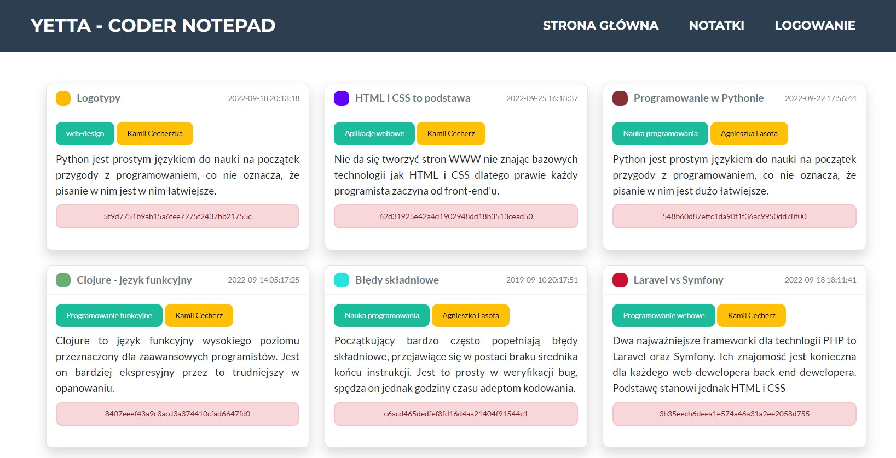

# Yetta

Simple web notes manager. Visit page: [yetta.cecherz.pl](http://yetta.cecherz.pl/)
# Changelog

- **version 1.0.5**
    - add possibility of registering new users
# Screenshots



# Requirements for developer
- [PHP](https://windows.php.net/download/) 
- DB Engine e.g [MariaDB Server](https://mariadb.org/download/?t=mariadb&p=mariadb&r=10.9.3&os=windows&cpu=x86_64&pkg=msim=bme)
- A Dependency Manager for PHP - [Composer](https://getcomposer.org/download/)
- [Laravel](https://laravel.com/docs/master)

# Laravel
- Run composer via command line

    ```
    composer global require laravel/installer
    ```

- Create new app

    ```
    laravel new example-app
    ```

# Deployment Guide
1. Clone repository
2. Create database and user with correct credentials:

    ```
    CREATE DATABASE YETTA_DB CHARACTER SET utf8 COLLATE utf8;
    CREATE USER 'root'@'localhost' IDENTIFIED BY 'password';
    GRANT ALL PRIVILEGES ON YETTA_DB.* TO 'root'@'localhost';
    ```

3. Edit file *.env.example* and create own *.env* run environment.
4. Connect to database:

    ```
    DB_CONNECTION=mysql
    DB_HOST=127.0.0.1
    DB_PORT=3306
    DB_DATABASE=yetta_db
    DB_USERNAME=root
    DB_PASSWORD=password
    ```
5. Run migrations:

    ```
    php migrate:fresh
    php artisan db:seed --class="SampleDataSeeder"
    ```

6. Start app:

    ```
    php artisan serve
    ```

# Security:
- Start email: **admin@mail.com**
- Start password: **admin**

If you want to change the authorization data, you do it in the database. Passwords are hidden, please use for help: **App\Http\Controllers**


```
    public function home() {
        $password = 'admin';
        $hashed = Hash::make($password);
        return view('index', ['pass' => $password .' = '.$hashed]);
    }
```

#  Tutorials
* [Laravel 9 Custom Auth Login and Registration](https://www.positronx.io/laravel-custom-authentication-login-and-registration-tutorial/)
* [Deploy Laravel To Shared Hosting The Easy Way](https://youtu.be/6g8G3YQtQt4)
* [How to create a multilingual project in Laravel 8](https://dev.to/jeromew90/how-to-create-a-multilingual-project-in-laravel-internationalization-i18n-11ol)
* [YT: Laravel Localization](https://www.youtube.com/watch?v=e6ccPgI8aHk)